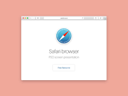

## Bye Devs!!!

    Estas son algunas palabras del creador de NVIDEA, diciendo que las IA, van a dominar las indiustras del mundo de la informatica, ¿Será Verdad?

    Hay muchas teorias de esa pregunta, que nunca será respondida hasta que pasé algo.

Feb 29,2024

## AstroDB

    Astro acaba de sacar su propia base de datos, llamada AstroDB

    Esto hizo que mucha gente se interesara más en AstroJS

Marzo 19,2024

## Google Despidiendo

    Google esta despidiendo a bastantes empleados, y eso hace que Google caiga en banca rota

    Por ahora la economia de Google esta bajando

Feb 29,2024

## Safari vs Google

    Safari vs Google, esa es una de las peleas que hay, porque Google quiere empezar a tener una nueva ley para el CSS pero Safari no lo quiere poner en su Navegador

    Hay que entender que Safari esta bajando mucho, y problablemente lo quiten...

Feb 18,2024

## Google Gemini

    Google Gemini tiene algunos problemas con esa IA

    Confundiendo los Colores de personas, haciendo Personas de IA, ¿Negros o Blancos?, es algo muy loco, pero tienen problemas con esta IA...

Feb 28,2024

